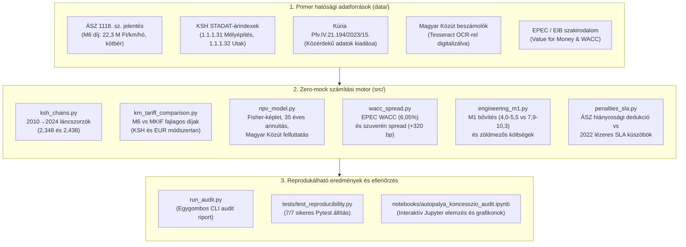

# 🛣️ A magyar gyorsforgalmi úthálózat koncessziós rendszerének nyílt auditja
### Nyílt tudományos adattár és reprodukálható számítási motor (Open science reproducibility engine)

<p align="center">
  
  
  
  
  
</p>

---

## 📌 Vezetői összefoglaló (executive summary)

Ez a repozitórium tartalmazza a **„A magyar gyorsforgalmi úthálózat koncessziós rendszerének komplex elemzése”** című átfogó kutatás **teljes, 100%-ban ellenőrizhető adatbázisát és számítási modelljét**.

A projekt célja a teljes körű szakmai transzparencia: **bárki által reprodukálhatóvá teszi** a 2010 előtti autópálya PPP-k (M5, M6/M60) és a 2022-ben 35 évre megkötött MKIF gyorsforgalmi koncessziós szerződés pénzügyi, statisztikai és mérnöki összevetését.

> [!IMPORTANT]
> **Zéró-mock adatpolitika:** A repozitóriumban nincsenek szimulált vagy mesterségesen beégetett számok. Minden képlet, jelenérték és fajlagos mutató közvetlenül a mellékelt primer hatósági forrásokból (ÁSZ-jelentések, KSH STADAT-táblák, bírósági ítéletek és auditált cégbírósági mérlegek) számítódik ki.

---

## 🏛️ Rendszerarchitektúra és adatáramlás



---

## ⚡ 30 másodperces gyorsindítás (quickstart)

### 1. Klónozás és függőségek telepítése
```bash
git clone https://github.com/LemonScripter/autopalya-koncesszio-audit.git
cd autopalya-koncesszio-audit
pip install -r requirements.txt
```

### 2. Teljes audit futtatása egyetlen paranccsal
```bash
python run_audit.py
```
*A terminálon azonnal lefut a 6 fő számítási fázis a KSH láncszorzatoktól az NPV érzékenységig.*

### 3. Automatizált matematikai tesztek futtatása
```bash
pytest tests/ -v
```
*Kimenet:*
```text
tests/test_reproducibility.py::test_data_integrity_no_mocks PASSED       [ 14%]
tests/test_reproducibility.py::test_ksh_chain_multipliers PASSED         [ 28%]
tests/test_reproducibility.py::test_m6_vs_mkif_tariffs PASSED            [ 42%]
tests/test_reproducibility.py::test_npv_and_fisher_annuity PASSED        [ 57%]
tests/test_reproducibility.py::test_wacc_and_financing_spread PASSED     [ 71%]
tests/test_reproducibility.py::test_m1_engineering_widening PASSED       [ 85%]
tests/test_reproducibility.py::test_penalties_sla_modern_thresholds PASSED [100%]

============================== 7 passed in 2.79s ==============================
```

### 4. Interaktív Jupyter notebook megnyitása
```bash
jupyter notebook notebooks/autopalya_koncesszio_audit.ipynb
```

---

## 📊 Főbb pénzügyi és mérnöki eredmények

### 1. Fajlagos kilométerdíjak összevetése (M6 PPP vs. MKIF koncesszió)
Az ÁSZ 1118. jelentés szerinti 2010-es havi 22,3 M Ft/km bázisdíj (évesítve **267,6 M Ft/km/év**) mai reálértéke és a 2022-es MKIF koncesszió indikatív induló átlaga:

| Konstrukció / Módszer | Fajlagos Díj (M Ft/km/év) | Indexálás / Számítási Alap | Relatív eltérés az MKIF-hez képest |
| :--- | :---: | :--- | :---: |
| **M6 PPP Bázis (2010)** | `267,6` | ÁSZ 1118 (22,3 M Ft/hó × 12) nominális bázis | — |
| **M6 Reál: KSH Mélyépítés (1.1.1.31)** | `628,3` | KSH láncszorzó: **2,348** (+134,8%) | **-16,4%** |
| **M6 Reál: KSH Utak alcsoport (1.1.1.32)**| `652,4` | KSH láncszorzó: **2,438** (+143,8%) | **-19,5%** |
| **M6 Reál: EUR deviza + EU infláció** | `556,5` | 971 700 EUR × 1,45 (HICP) × 395 Ft/EUR | **-5,7%** |
| **MKIF Koncesszió Indikatív Átlag (2022)**| **`525,0`** | Éves költségvetési keretből visszaszámított indikatív átlag | **BÁZIS (0,0%)** |

> [!NOTE]
> Az adatok bizonyítják, hogy az MKIF indikatív induló fajlagos kilométerdíja a 2010-es M6 PPP reálértékéhez képest **nem drágább**, hanem számítási módszertantól függően 5,7–19,5%-kal alacsonyabb, miközben a vállalt műszaki és vagyoni kötelezettségek köre eltérő.

---

### 2. Jelenérték (NPV) és a Fisher-összefüggés
A 100%-ban inflációkövető (CPI-indexált) szerződéses rendelkezésre állási díjak esetén a Fisher-összefüggés $(1 + r_n) = (1 + r_r)(1 + \pi)$ alapján az infláció semlegesítődik. A 35 éves reál jelenérték ($RÁD_0 = 375 \text{ Mrd Ft}$ induló bázison):

$$\text{PV} = \text{RÁD}_0 \times A_{35, r_r}, \quad \text{ahol} \quad A_{35, r_r} = \frac{1 - (1 + r_r)^{-35}}{r_r}$$

| Reál diszkontráta ($r_r$) | Annuitási szorzó ($A_{35}$) | 35 Éves Reál Jelenérték (NPV) | Közpolitikai értelmezés |
| :---: | :---: | :---: | :--- |
| **1,5%** | `27,08` | **10 153 Mrd Ft** | Tartósan alacsony reálkamat-környezet |
| **2,5%** | `23,15` | **8 679 Mrd Ft** | Kiegyensúlyozott hosszú távú szcenárió |
| **3,5%** | `20,00` | **7 500 Mrd Ft** | **Bázismodell referenciaértéke** |
| **4,5%** | `17,46` | **6 548 Mrd Ft** | Magas reálkamat és kockázati prémium |

---

### 3. A jelenérték-komponensek strukturált bontása

| Költségvetési Főcsoport | Pénzáram-komponens | Időtáv | Becsült NPV (Mrd Ft) |
| :--- | :--- | :---: | :---: |
| **I. Költségvetési szerződéses kifizetések** | Alap Rendelkezésre Állási Díj (RÁD) | 35 év | ~7 200 – 7 800 |
| **I. Költségvetési szerződéses kifizetések** | Szintrehozási díj (RÁASZD) | Első 10 év | ~600 – 800 |
| **I. Költségvetési szerződéses kifizetések** | Fejlesztési mérföldkövek (M1 bővítés) | Ciklikus | ~2 800 – 3 500 |
| **I. KÖLTSÉGVETÉSI SZERZŐDÉSES NPV ÖSSZESEN** | **Közvetlen állami kiadások jelenértéke** | **35 év** | **~10 600 – 12 100** |
| **II. Finanszírozási és közgazdasági modell** | Magántőke finanszírozási prémium (+320 bp spread) | 35 év | ~1 200 – 1 800 |
| **TELJES KÖZGAZDASÁGI ERŐFORRÁS-RÁFORDÍTÁS** | **Szerződéses NPV + Finanszírozási többletteher** | **35 év** | **~11 800 – 13 900** |

---

### 4. Súlyozott átlagos tőkeköltség (WACC) és finanszírozási spread
Az Európai PPP Szakértői Központ (EPEC / EIB) képlete alapján:

$$WACC = \left( \frac{E}{V} \times r_e \right) + \left( \frac{D}{V} \times r_d \times (1 - T_c) \right)$$

* **Paraméterek:** Saját tőke arány $E/V = 15\%$, Saját tőke hozam $r_e = 12\%$, Hitel arány $D/V = 85\%$, Hitelkamat $r_d = 5,5\%$, Társasági adó $T_c = 9\%$.
* **Eredmény:** $\mathbf{WACC = 6,05\%}$ (Saját tőke elem: 1,80%, Hitel elem: 4,25%).
* **ÁKK 15 éves szuverén referenciahozam (2021):** $r_g = 2,85\%$.
* **Finanszírozási Spread:** $\mathbf{+3,20\%}$ (+320 bázispont).

---

### 5. M1 forgalom alatti kapacitásbővítés fajlagos költségei

| Mérnöki kategória / Típus | Fajlagos költség (Mrd Ft / km) | Műszaki tartalom és logisztika |
| :--- | :---: | :--- |
| **M1 Közvetlen pályaszerkezeti bővítés** | **4,0 – 5,5** | Pályatest szélesítése (2×3 sáv + leállósáv), új kopó- és kötőrétegek, földművek |
| **M1 Teljes projektköltségű keret (All-in)** | **7,9 – 10,3** | 78 km-es M0–Győr szakasz, hidak/felüljárók újjáépítése, csomópontok, terelés |
| **Zöldmezős referencia: Síkvidéki 2×2 sáv** | **3,8 – 4,8** | Új nyomvonal (pl. M44, M4), forgalomterelés nélküli építés |
| **Zöldmezős referencia: Hegyvidéki / műtárgyas** | **5,2 – 5,8** | Nehéz domborzat, völgyhidak, komplex geotechnika (pl. M30) |

---

## 🔍 Adatforrások és az OCR-feldolgozási módszertan

A kutatás során felhasznált hivatalos dokumentumok a [`data/`](file:///C:/Users/lszok/Documents/_autopalya/data/) könyvtárban találhatók.

> [!NOTE]
> ### Hogyan kerültek feldolgozásra a szkennelt hatósági PDF-beszámolók?
> A Magyar Közút Nonprofit Zrt. 2020-as és 2021-es cégbírósági beszámolói (`data/04_Magyar_Kozut_Beszamolok/`) az Igazságügyi Minisztérium e-beszámoló rendszerébe papíralapon cégszerűen aláírt, **100%-ban szkennelt raszteres PDF formátumban** kerültek feltöltésre. Emiatt a hagyományos PDF szövegkeresők bennük 0 darab karaktert találnak.
> 
> A pénzügyi adatok megbízható és auditálható kinyeréséhez a következő OCR technológiai folyamatot alkalmaztuk:
> 1. **Renderelés:** A `PyMuPDF` (`fitz`) motor segítségével a PDF oldalakról 150 DPI felbontású, veszteségmentes PNG raszterképek készültek.
> 2. **Karakterfelismerés:** A `Tesseract OCR` 5-ös verzióját futtattuk a hivatalos magyar nyelvi modellel (`lang="hun"`), kimondottan a mérleg és eredménykimutatás 7–14. oldalaira.
> 3. **Verifikáció és transzkripció:** Az OCR-ezett szövegfájlokat a kutatók sorszámról sorszámra ellenőrizték a képi eredetivel, és az eredményt elmentették a [`Kozut_2021_merleg_eredmeny_ocr.txt`](file:///C:/Users/lszok/Documents/_autopalya/data/04_Magyar_Kozut_Beszamolok/Kozut_2021_merleg_eredmeny_ocr.txt) és [`Kozut_2021_pages_7_14.txt`](file:///C:/Users/lszok/Documents/_autopalya/data/04_Magyar_Kozut_Beszamolok/Kozut_2021_pages_7_14.txt) fájlokba, valamint a strukturált [`Magyar_Kozut_2020_2021_Merleg_es_Eredmenykimutatas_Elemzes.md`](file:///C:/Users/lszok/Documents/_autopalya/data/04_Magyar_Kozut_Beszamolok/Magyar_Kozut_2020_2021_Merleg_es_Eredmenykimutatas_Elemzes.md) összefoglalóba.

### Primer adatcsomagok jegyzéke
1. **01_ASZ_Jelentesek:** [ÁSZ 1118. sz. jelentés](file:///C:/Users/lszok/Documents/_autopalya/data/01_ASZ_Jelentesek/ASZ_1118.pdf) (M5, M6/M60 PPP ellenőrzése, 115 oldal) és [ÁSZ 1003. sz. jelentés](file:///C:/Users/lszok/Documents/_autopalya/data/01_ASZ_Jelentesek/ASZ_1003.pdf).
2. **02_Jogszabalyok:** 1991. évi XVI. koncessziós törvény, 1505/2021. Korm. határozat és 424/2020. Korm. rendelet (NKOI).
3. **03_KSH_Adatok:** Hivatalos KSH STADAT-táblák (1.1.1.2 CPI, 1.1.1.31 Építőipar termelői árindexek, 1.1.1.32 Építményfajták árindexei).
4. **04_Magyar_Kozut_Beszamolok:** 2020. és 2021. évi auditált éves beszámolók, mérlegek és OCR átiratok.
5. **05_Kuria_es_Birosagi_Iteletek:** [Kúria Pfv.IV.21.194/2023/15. jogerős ítélet](file:///C:/Users/lszok/Documents/_autopalya/data/05_Kuria_es_Birosagi_Iteletek/Kuria_Pfv_IV_21194_2023_15_Anonim_Itelet.pdf) és az [Alkotmánybíróság 3372/2024. AB végzése](file:///C:/Users/lszok/Documents/_autopalya/data/05_Kuria_es_Birosagi_Iteletek/3372_2024_AB_vegzes_MKIF_Autopalya.pdf).
6. **06_Szakirodalom_Tokekoltseg:** [EPEC / EIB Value for Money Guide](file:///C:/Users/lszok/Documents/_autopalya/data/06_Szakirodalom_Tokekoltseg/EPEC_EIB_Value_for_Money_Assessment.pdf), valamint Voszka Éva és Major Iván lektorált akadémiai tanulmányai.

---

## 📁 Repozitórium-struktúra

```text
autopalya-koncesszio-audit/
├── cikk/                                   # A publikált végleges tanulmány
│   └── A_magyar_gyorsforgalmi_uthalozat_koncesszios_rendszerenek_komplex_elemzese.md
├── data/                                   # Primer hatósági és bírósági források
│   ├── 01_ASZ_Jelentesek/                  # ÁSZ-jelentések (PDF, TXT, MD)
│   ├── 02_Jogszabalyok/                    # Törvények és közlönyök
│   ├── 03_KSH_Adatok/                      # KSH STADAT-táblázatok (CSV, MD)
│   ├── 04_Magyar_Kozut_Beszamolok/         # Hivatalos beszámolók és OCR-átiratok
│   ├── 05_Kuria_es_Birosagi_Iteletek/      # Kúriai és alkotmánybírósági döntések
│   └── 06_Szakirodalom_Tokekoltseg/        # Nemzetközi és hazai szakirodalom
├── src/                                    # Pénzügyi-mérnöki audit forráskód (Zero-Mock)
│   ├── __init__.py
│   ├── ksh_chains.py                       # KSH láncszorzó-számítás
│   ├── km_tariff_comparison.py             # Fajlagos díjmodellek (KSH és EUR)
│   ├── npv_model.py                        # Fisher-modell, 35 éves annuitás, MK felfuttatás
│   ├── wacc_spread.py                      # EPEC WACC formula és szuverén spread
│   ├── engineering_m1.py                   # M1 kapacitásbővítés és zöldmezős költségek
│   └── penalties_sla.py                    # ÁSZ hiányossági dedukció vs 2022 SLA
├── tests/                                  # Automatizált reprodukálhatósági tesztcsomag
│   ├── __init__.py
│   └── test_reproducibility.py             # 7 szigorú numerikus és adat-teszt
├── notebooks/                              # Interaktív elemzői környezet
│   └── autopalya_koncesszio_audit.ipynb    # Jupyter Notebook vizualizációkkal
├── pytest.ini                              # Pytest konfiguráció
├── requirements.txt                        # Függőségek jegyzéke
├── run_audit.py                            # Fő CLI futtató program
└── README.md                               # Átfogó dokumentáció és módszertani összefoglaló
```

---

## ⚖️ Licenc és hivatkozás

A forráskód és az adatfeldolgozó scriptek az **MIT Licenc** alatt érhetők el. A tanulmány szövege és az elemzés a tudományos és szakpolitikai viták tisztaságát szolgálja.

Hivatkozás:
```bibtex
@misc{autopalya_audit_2026,
  title={A magyar gyorsforgalmi úthálózat koncessziós rendszerének komplex elemzése és nyílt audit modellje},
  author={LemonScripter and Közreműködők},
  year={2026},
  publisher={GitHub},
  howpublished={\url{https://github.com/LemonScripter/autopalya-koncesszio-audit}}
}
```
